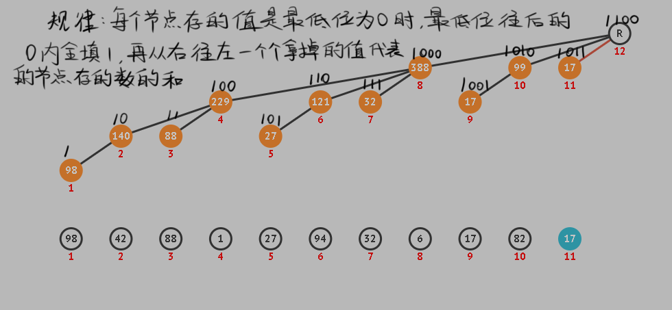

# 树状数组

## 这玩意是啥？

低情商：树状数组或二叉索引树（英语：Binary Indexed Tree），又以其发明者命名为Fenwick树，最早由Peter M. Fenwick于1994年以A New Data Structure for Cumulative Frequency Tables为题发表在SOFTWARE PRACTICE AND EXPERIENCE。其初衷是解决数据压缩里的累积频率（Cumulative Frequency）的计算问题，现多用于高效计算数列的前缀和， 区间和。

高情商：一种用于快速处理单点修改，区间和查询的工具


## 典型的用例？

+ 涉及单点修改的区间求和问题
> 典型问法：
>       迫真空手部有13个小团体，分别有[1, 1, 4, 5, 1, 4, 1, 9, 1, 9, 8, 1, 0]个部员(没人的就地解散罢)
>       Day1，有**5**个部员被~~诱骗~~招进了**最后一个**小团体
>       Day2，第**3**个小团体有**2**个部员摄入了致死量的红茶，被抬进了ICU，自此退部
>       Day3，管理员木村想要知道**前9个**小团体里面**一共**有多少部员
>       Day4，因为DSSQ化严重，第**1**个小团体部员暴涨为**931**个
>       Day5，有小鬼想要问你知不知道**第4个到第11个**小团体里面**一共**有多少部员
>       Day6，...
+ 求逆序对
> 典型问法：
>       你加了一个二刺螈交流群。过年了，萌二群主要求你们按顺序晒出wyy年度听歌报告~~来踢掉二刺螈浓度不足的假群友~~
>       群里突然出现了一种奇怪的风气：后面晒浓度的人看到**前面**若是有人浓度比他/她高，就会向前面的人发送击剑邀请（？）
>       你们的mmr群主不想把好好一个二刺螈群变成同性交友群，他让你统计一共有多少条击剑邀请
+ 涉及单点修改的RMQ(Range Maximum/Minimum Query, 区间最值查询)问题
> 典型问法：
>       你在[合成大西瓜](http://www.wesane.com/game/654/?dt_dapp=1&dt_dapp=1)，每个水果视为一个圆，有一个半径，这里假设水果数量固定并且每个有一个唯一的编号，游戏过程中因为合成，每次会有某个水果的半径改变，你希望知道每次水果半径改变之后某些编号区间内最小/大的那个半径有多大。


## 有没有什么办法速成？

如果只是想快速解决问题，不愿意了解具体实现的话，可以直接贴敲好的板子，参考[FenwickTree.cpp](FenwickTree.cpp)

里面有详细的用法说明，已经把具体实现抽象掉了

## 你给这些不够用，我想知道原理？

[动态演示](https://visualgo.net/zh/fenwicktree)

我们不讨论问什么能这么搞，以及是谁想出来能这么搞的，因为这不重要

重要的是，**这么搞凑效**

打开动态演示网站，点左下的创建，键入你随便想的一个数列，然后点执行，可以看到建树过程

注意此处说的*树*是用数组表示的，节点编号即数组下标


先说要点，建立树状数组时，**一定要从下标1开始建**，因为用到二进制性质。如果你非要用0位置的空间可以做完主要操作再整体前移，这是后话

我们直接看看各个节点的二进制，来找规律:


其中lowbit可以根据x很快算出来：
```c++
int lowbit(int x){return x&-x;}
// 或者写成lambda
auto lowbit = [](int x) -> int {return x&-x;};
```

<details>
<summary>G++关于位的扩展用法</summary>
https://www.geeksforgeeks.org/builtin-functions-gcc-compiler/
<pre><code>
__builtin_clz();   // 数给定数的前导零(32位下)，count leading zero
__builtin_clzll(); // 数给定数的前导零(64位下)，count leading zero
__builtin_ctz();   // 数给定数的后导零(32位下)，count trailing zero
__builtin_ctzll(); // 数给定数的后导零(64位下)，count trailing zero
__builtin_popcount();   // 数给定数里二进制'1'的个数(32位)
__builtin_popcountll(); // 数给定数里二进制'1'的个数(64位)
</code></pre>
</details>

既然可以通过+lowbit爬到它的父节点，那我们令每个父节点保存所有直接相连的子节点的和那么我们已经可以根据给定序列构建求和型树状数组了。

只需要遍历每个节点
    对每次操作，往父节点爬，给父节点加上当前节点的值，然后再往上爬，直到数组越界退出即可
```c++
inline void build()
{
    for (int i = len; i > 0; i--) // 倒序建树防止重复计算
        for (int j = i + lowbit(i); j <= len; j += lowbit(j))
            _start[j - 1] += _start[i - 1]; // 这里-1是为了利用0号下标的空间，即前面说的整体前移
}
```

更新一个节点？

只需要算出修改后的值和当前值的差分，然后一路往祖宗方向爬，所到之处加上这个差分即可。

```c++
void modify(int ind, T &x) // 在ind下标处将值修改为x，下标(ind)从1开始
{
    T diff = x - _start[ind - 1]; // 这里为了方便用了差分修改
    while (ind <= len)
    {
        _start[ind - 1] += diff;
        ind += lowbit(ind);
    }
}
```

区间求和？

继续观察规律：



举个例子，

0b1110010000(二进制的912)所存的答案其实包括0b1110000001~0b1110001111，

0b1110000000(二进制的896)所存的答案其实包括0b1100000001~0b1101111111

首先考虑前缀和，如果我们需要获取树状数组储存数值的前缀和

考虑到每个点储存的值和其最低位有关，那么我们每次只需要**减去其最低位**，合并答案，直到最低位用完了（为0）即可获得前缀和。
```c++
T get_prefix(int pos)
{
    T x = _start[pos - 1];
    while (pos > 0)
        x += _start[(pos -= lowbit(pos)) - 1];
    return x;
}
```
那么由于区间和的可减性，区间求和只需要查询两次前缀和，用右区间的前缀和减去左-1区间的前缀和即可

```c++
T query(int l, int r) { return get_prefix(r) - get_prefix(l - 1); }
```

RMQ?

如果要用树状数组做RMQ问题，则建树的时候父节点就不能保存儿子的和了，因为没用。

最小值和最大值思路相似，这里只讨论最大值。

最大值的建树过程中得令父节点保存子节点的最大值，但因为最大值没有可减性，所以更新和查询会和求和型线段树有区别。但最大值的传递性可以利用，所以更新和查询有O((logn)^2)的做法

建树阶段和求和型大同小异
```c++
inline void build()
{
    for (int i = len; i > 0; i--)
        for (int j = i + lowbit(i); j <= len; j += lowbit(j))
            _start[j - 1] = std::max(_start[j - 1], _start[i - 1]);
}
```

修改时每往上爬一个父节点，父节点的值要根据其所有子节点的值重新计算才能保证正确性。

```c++
void modify(int ind, T &x, T *origin = NULL) // 将ind位置修改为x，下标还是从1开始，因为查询用到，所以要传入原序列origin一起改
{
    if (not origin)
        origin = _origin;
    origin[ind - 1] = x;
    _start[ind - 1] = x;
    while (ind <= len)
    {
        int lowest = lowbit(ind);
        for (auto i = 1; i < lowest; i <<= 1) // 最大值的修改是log方的，因为这位要维护前面低位负责的几个节点
            _start[ind - 1] = std::max(_start[ind - i - 1], _start[ind - 1]);
        ind += lowbit(ind); // 当然还要向上合并
    }
}
```

查询会有点费解。因为不能利用前缀查询结果，我们考虑从右区间逐次逼近左区间来获得答案。


每次可以跳一个**lowbit**或者**1**的位置，如何选择呢？如果减去lowbit的右区间越过了左区间，那只能跳1，此时用源数组的这个位置的数更新一下答案往下走（就是朴素暴力求区间最值的做法）；如果减去了lowbit没越过左区间，那树里面存的值就有用，用来更新答案，然后跳lowbit

```c++
T query(int l, int r, T *origin = NULL) // 查询[l,r]内的最大值，需要传入原序列
{
    if (not origin)
        origin = _origin;
    T res = origin[r - 1];
    while (l < r)
    {
        for (--r; r - lowbit(r) >= l; r -= lowbit(r)) // 若能跳lowbit，则跳lowbit
            res = std::max(res, _start[r - 1]);
        res = std::max(res, origin[r - 1]); // 否则用--r跳一个点
    }
    return res;
}
```

## 如果有区间加法怎么办？

## 树状数组RMQ太难受了有没有更优雅的办法？

参见[ZKW线段树](Assets/黑魔法：zkw线段树.md)

以及[现成模板](Assets/ZKW.cpp)

## 学累了？

~~摸鱼阅读资料:~~

+ [这些课堂上不教的 C++ 的基本特性你都知道吗？](https://zhuanlan.zhihu.com/p/149839787)
+ [关于cin到底是什么东西和怎么用的问题](https://www.luogu.com.cn/blog/hajbw10/about-cin)
+ [比STL还STL？——平板电视](https://www.luogu.com.cn/blog/Chanis/gnu-pbds)
+ [可以代替线段树的树状数组?——树状数组进阶(1)](https://www.luogu.com.cn/blog/Chanis/super-BIT)
+ [可以代替平衡树的树状数组?——树状数组进阶(2)](https://www.luogu.com.cn/blog/Chanis/super-BIT2)

实用C草语法糖学习建议：

+ foreach语句(C++11)
+ auto自动类型推断(C++11)
+ auto [x, y] = structure 参数解包 (C++17)
+ 运算符重载/lambda表达式(用于sort)

~~找找彩蛋~~
