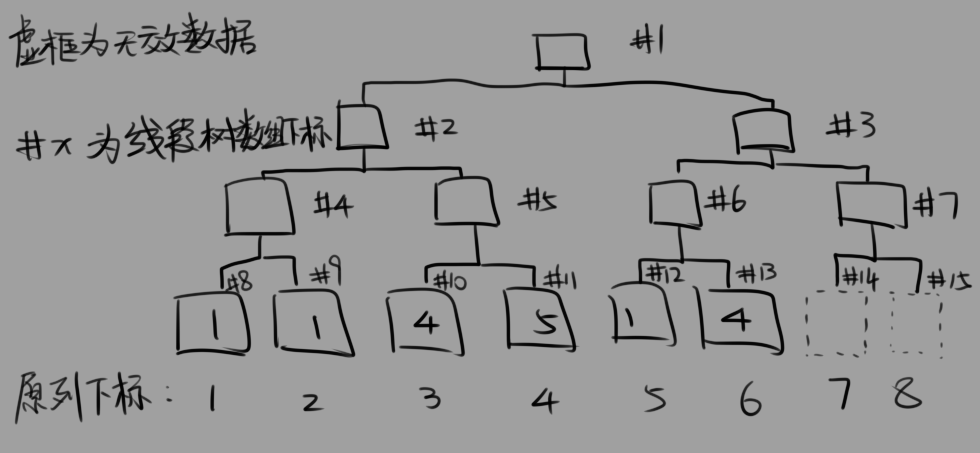
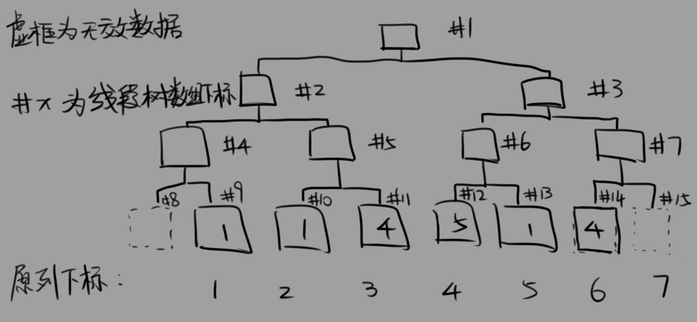

# 阅读材料

[源PPT](https://wenku.baidu.com/view/f27db60ee87101f69e319544.html)

[魔改：使用lazy_tag(1)](https://zhuanlan.zhihu.com/p/29876526)
[魔改：使用lazy_tag(2)](https://zhuanlan.zhihu.com/p/29937723)

# ZKW线段树

事实上如果把ZKW线段树上Tag的话就会失去其常数优势，而且比传统线段树更加费解。这里只介绍差分型（标记永久化）。

注意原生差分型只是用来求带区间加法的RMQ问题的。

类似树状数组，线段树也可以用数组表示，而且考虑到线段树是完全二叉树，和满二叉树区别不大，那我们大可直接开一个装得下指定规模的满二叉树的数组来存一棵线段树。



为了方便后面的开区间查询不至于越界，我们得保证让这棵满二叉树最左边的叶子和最右边的叶子不存放数据（如果剪掉两个叶子空间不够就直接开大一倍）



开合适大小的数组以及把数据直接读入数组最后一层这里就不说怎么实现了

zkw线段树是一种非递归式线段树，它用数组形式储存线段树的节点，其节点编号有如下关系：

+ 左儿子节点号是父节点 << 1
+ 右儿子节点号是父节点 << 1 | 1

建树的时候我们令子节点只存与父节点的差分，父节点根据需要存两儿子中的最小值或最大值（分别用来解决区间最小值\最大值问题）

```c++
void build()
{
    _start[M].min_content = 0;
    _start[M].max_content = 0;
    for (int i = M - 1; i > 0; i--) // 以M开始会越界，而且M的两个孩子都不是有效存储位
    {                               //build的时候用的min，则只能查区间最小值，用max则只能查最大值，这里用两个单位分开存
        _start[i].min_content = min(_start[i << 1].min_content, _start[i << 1 | 1].min_content);
        _start[i << 1].min_content -= _start[i].min_content;
        _start[i << 1 | 1].min_content -= _start[i].min_content;

        _start[i].max_content = max(_start[i << 1].max_content, _start[i << 1 | 1].max_content);
        _start[i << 1].max_content -= _start[i].max_content;
        _start[i << 1 | 1].max_content -= _start[i].max_content;
    }
}
```

单点修改时怎么更新呢？

类似树状数组，我们有：

  1. 更新叶子节点（源序列值）
  2. 重算父亲节点值，更新左右节点差分
  3. 往上爬，重复第二步，直到没有能爬的

那么区间加法呢？

考虑获得一个节点的兄弟节点：可以直接拿它的节点号 xor 1得到

我们把闭区间区间加法转换为开区间，即左区间-1，右区间+1

这样，我们可以这么搞：

  1. 当左区间是左孩子时，它的兄弟一定落在修改区间内，那么改它的兄弟
  2. 当右区间是右孩子时，它的兄弟一定落在修改区间内，那么改它的兄弟
  3. 重算父子差分
  4. 往上爬，因为当前层的区间已经改过，往上爬时父亲已经变为开区间

因为存的是差分，所以我们可以直接修改节点里存的值（想想为什么？）

带着这样的思路我们看一下代码：

```c++
void maintain(int ind)
{
    auto L = ind << 1;
    auto R = L | 1;
    auto tmp = min(_start[L].min_content, _start[R].min_content);
    _start[L].min_content -= tmp;
    _start[R].min_content -= tmp;
    _start[ind].min_content += tmp;

    tmp = max(_start[L].max_content, _start[R].max_content);
    _start[L].max_content -= tmp;
    _start[R].max_content -= tmp;
    _start[ind].max_content += tmp;
}

void range_add(int l, int r, T &x)
{
    for (l += M - 1, r += M + 1; l ^ r ^ 1; l >>= 1, r >>= 1)
    {
        if (~l & 1)
            _start[l ^ 1].min_content += x, _start[l ^ 1].max_content += x;
        if (r & 1)
            _start[r ^ 1].min_content += x, _start[r ^ 1].max_content += x;
        maintain(l >> 1);
        maintain(r >> 1);
    }
    maintain(l);
    while (l > 1)
    {
        maintain(l >>= 1);
    }
}
```

~l & 1 表示l为左孩子，r&1表示r为右孩子。为什么？**找规律**。

然后就是RMQ

```c++
T getval(int ind)
{
    T res = 0;
    for (ind += M; ind; ind >>= 1)
        res += _start[ind].max_content;
    return res;
}

T query_min(int l, int r)
{
    if (l == r)
        return getval(l);
    T L = 0;
    T R = 0;
    for (l += M, r += M; l ^ r ^ 1; r >>= 1, l >>= 1)
    {
        L += _start[l].min_content;
        R += _start[r].min_content;
        if (~l & 1)
            L = min(L, _start[l ^ 1].min_content); // 若l是左儿子，用右儿子的值更新，否则因为是开区间，不用算这一层的值
        if (r & 1)
            R = min(R, _start[r ^ 1].min_content); // 若r是右儿子，用左儿子的值更新，否则因为是开区间，不用算
    }
    L += _start[l].min_content;
    R += _start[r].min_content;
    L = min(L, R);
    while (l > 1)
        L += _start[l >>= 1].min_content;
    return L;
}
T query_max(int l, int r)
{
    if (l == r)
        return getval(l);
    T L = 0;
    T R = 0;
    for (l += M, r += M; l ^ r ^ 1; r >>= 1, l >>= 1)
    {
        L += _start[l].max_content;
        R += _start[r].max_content;
        if (~l & 1)
            L = max(L, _start[l ^ 1].max_content); // 若l是左儿子，用右儿子的值更新，否则因为是开区间，不用算这一层的值
        if (r & 1)
            R = max(R, _start[r ^ 1].max_content); // 若r是右儿子，用左儿子的值更新，否则因为是开区间，不用算
    }
    L += _start[l].max_content; // 不能漏了l r为兄弟节点时他们的节点值
    R += _start[r].max_content;
    L = max(L, R);
    while (l > 1)                         // =1时下一行会读到0号点，而0号点是无效的并且没有初始化的信息
        L += _start[l >>= 1].max_content; // 没走到根（1号点）的话要往根走，把差分算完才能得到源信息
    return L;
}
```

为什么能直接用隔壁的值来更新答案呢？

存差分的时候，父亲节点存的是两个孩子中的最大/小值，也就是说父亲节点已经存好了它底下所有叶子中的最大/小值，并且一定存在一个往下走一路是0的路径，即一个答案，所以可以这么搞。

好的，现在你已经会写线段树了
